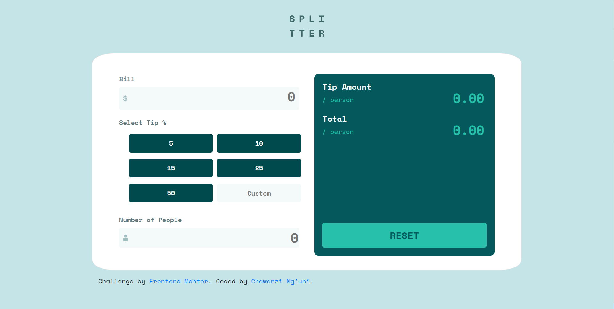

# Frontend Mentor - Tip calculator app solution

This is a solution to the [Tip calculator app challenge on Hacknovate3.0

## Overview

### The challenge

Users should be able to:

- View the optimal layout for the app depending on their device's screen size
- See hover states for all interactive elements on the page
- Calculate the correct tip and total cost of the bill per person

### Screenshot

## My process

### Built with

- Semantic HTML5 markup
- CSS
- Flexbox
- CSS Grid
- Mobile-first workflow
- Vanilla JavaScript

## Getting started
To get a local copy up and running follow these simple example steps.

### Prerequisites
- Gitbash installed to navigate between the branches.
- A preferred text editor for example VS Code.

### Install
Clone this [GitHub Repo](https://github.com/Akhil-chaudhary/TipCalculator.git) to your computer on yourFolder by typing these commands in the terminal or download as a Zip file and extract.

$ mkdir yourFolder

$ cd yourFolder

$ git clone https://github.com/Akhil-chaudhary/TipCalculator.git

## 🤝 Contributing

Contributions, issues, and feature requests are welcome!

Feel free to check the [issues page](https://github.com/chaw-bot/TipCalculator/issues).

## Show your support

Give a ⭐️ if you like this project!

